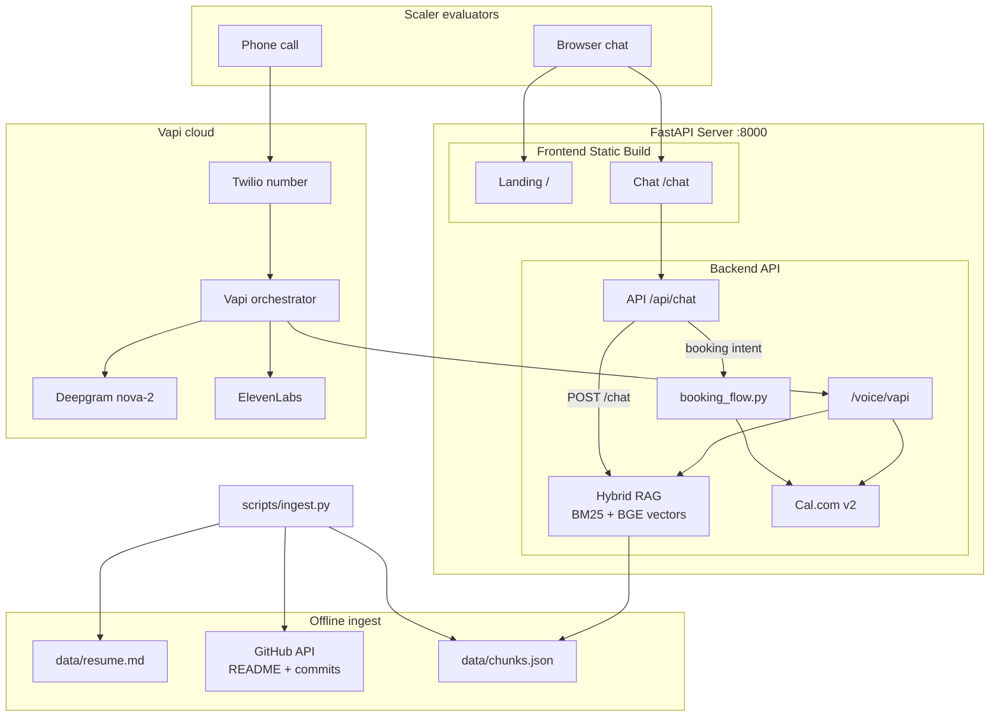

# Vasanth Banoth — AI Hiring Persona

End-to-end AI representative for the **Scaler AI Engineer Intern** screening: voice agent, RAG-grounded chat, and real Cal.com booking.

[](docs/ARCHITECTURE.md) · [Submit guide](SUBMIT.md)

## What evaluators get

| Part | Deliverable |
|------|-------------|
| **A — Voice (35%)** | Vapi phone number · `search_knowledge` · `get_availability` · `book_interview` |
| **B — Chat (35%)** | Public `/chat` URL · hybrid RAG · booking from chat · injection-safe |
| **C — Evals (30%)** | `evals/output/eval_report.pdf` · golden Q&A · voice test scripts |

## Stack

| Layer | Tech |
|-------|------|
| Chat UI | Next.js 15, Tailwind, Vercel AI SDK |
| API | FastAPI, hybrid BM25 + BGE vectors, Groq/OpenAI LLM |
| Corpus | `resume.md` + GitHub READMEs/commits → `chunks.json` |
| Voice | Vapi · Deepgram nova-2 · ElevenLabs · Twilio |
| Calendar | Cal.com API v2 |
| Deploy | Vercel (web) + Render (API) |

## Quick start

```bash
cp .env.example .env
# Fill keys (see SUBMIT.md). Minimum for local RAG: EMBEDDING_PROVIDER=local

./scripts/setup.sh             # ingest + deps + build frontend
./scripts/start.sh             # Server on port 8000
```

- Landing & Chat: http://localhost:8000
- API Docs: http://localhost:8000/docs

## Architecture



## Voice setup

```bash
# After Render API is live:
./scripts/configure_vapi.sh
# Import voice/vapi-assistant.ready.json in Vapi dashboard
# Run 5 test calls: voice/TEST_SCRIPTS.md
```

## Evals (Part C)

```bash
python evals/run_chat_eval.py      # needs live API + OPENAI_API_KEY (judge)
python evals/run_voice_eval.py     # update metrics after voice tests
python evals/generate_report.py    # → evals/output/eval_report.pdf
```

## Deploy

**Unified Deployment** = The Next.js frontend is built statically and served by the FastAPI backend on a single port. Simply deploy the `Dockerfile` to a service like Render or Fly.io. **Vapi** handles the phone number.

See **[docs/DEPLOY.md](docs/DEPLOY.md)** for step-by-step instructions.

## Cost

| Item | ~USD |
|------|------|
| Voice call 5 min | 0.08–0.15 |
| Chat session | 0.03–0.06 |
| Ingest (local BGE) | 0 |

## Security

- `.env` gitignored — keys only in Vercel/Render dashboards
- Chat proxies to FastAPI server-side; browser never sees API keys

## Author

**Vasanth Banoth** — [GitHub](https://github.com/vasanthbanoth) · thevasanthbanoth@gmail.com
