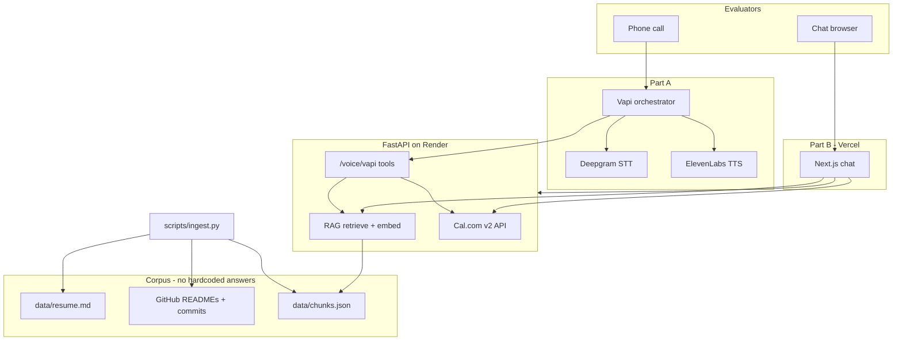

# Vasanth Banoth — AI Hiring Persona

End-to-end AI representative for the **Scaler AI Engineer Intern** screening assignment: phone voice agent, RAG-grounded public chat, and real Cal.com booking — no human in the loop.

| Part | Deliverable | Weight |
|------|-------------|--------|
| A | Live phone number (Vapi + Twilio) | 35% |
| B | Public chat URL (Next.js + FastAPI RAG) | 35% |
| C | 1-page eval PDF | 30% |

## Architecture



## Repo layout

```
├── apps/web/              # Next.js chat UI
├── services/api/          # FastAPI: RAG, chat, Cal.com, Vapi webhooks
├── scripts/ingest.py      # Build corpus from resume + GitHub
├── voice/                 # Vapi assistant JSON + setup notes
├── evals/                 # Golden Q&A + PDF report generator
├── data/resume.md         # Your resume (edit before ingest)
└── Dockerfile             # API container for Render
```

## Quick start (local)

### 1. Environment

```bash
cp .env.example .env
# Fill: OPENAI_API_KEY, CALCOM_*, optional GITHUB_TOKEN (higher rate limits)
```

### 2. Ingest corpus (required once)

```bash
python3 -m venv .venv && source .venv/bin/activate
pip install -r services/api/requirements.txt httpx tiktoken python-dotenv
python scripts/ingest.py
# → data/chunks.json (gitignored; upload to Render or bake into deploy)
```

### 3. Run API

```bash
cd services/api
PYTHONPATH=. uvicorn app.main:app --reload --port 8000
```

### 4. Run (chat included — no npm required)

```bash
./scripts/start.sh
```

Open **http://localhost:8000/chat**

Optional Next.js UI: `cd apps/web && npm install && npm run dev` (needs Node/npm).

## Deploy (submission path)

| Service | Platform | Notes |
|---------|----------|-------|
| API | [Render](https://render.com) | Connect repo, use `render.yaml`, set env vars |
| Chat | **Same Render URL** `/chat` | Or optional Vercel `apps/web` |
| Voice | [Vapi](https://vapi.ai) | Import `voice/vapi-assistant.json`, point tools to Render URL |
| Calendar | [Cal.com](https://cal.com) | Free event type → API key + event type ID |

After deploy:

1. Re-run `ingest.py` locally, copy `data/chunks.json` to Render (shell) **or** run ingest in Render shell with env vars.
2. Hit `GET /health` → `chunks_loaded > 0`.
3. Attach Vapi phone number; test 3 calls + 3 chat bookings.

## Cost breakdown (estimate)

| Item | Per unit | Notes |
|------|----------|-------|
| Voice call (~5 min) | ~$0.08–0.15 | Vapi + Twilio + Deepgram + ElevenLabs bundled |
| Chat session (~10 turns) | ~$0.02–0.05 | gpt-4o-mini + embedding search |
| Ingest (one-time) | ~$0.05 | text-embedding-3-small × ~400 chunks |
| Render free tier | $0 | Cold starts possible |
| Vercel hobby | $0 | |

## Evals (Part C)

```bash
python evals/run_chat_eval.py      # needs running API + OPENAI_API_KEY
python evals/generate_report.py    # → evals/output/eval_report.pdf
```

Update voice metrics in `evals/generate_report.py` after your test calls.

## Loom outline (≤4 min)

1. **0:00–0:45** — Architecture diagram (voice + chat share one RAG API)
2. **0:45–1:30** — Live chat: repo question + adversarial prompt
3. **1:30–2:15** — Live call: book a slot via voice
4. **2:15–3:30** — Hard problem: honest RAG under injection + in-memory retrieval tradeoff
5. **3:30–4:00** — Eval numbers + 7-day uptime confirmation

## Security

- Never commit `.env` or API keys.
- `data/chunks.json` contains embeddings only — no secrets.
- Vapi webhook protected via `x-vapi-secret` header.

## Author

**Vasanth Banoth** — [GitHub](https://github.com/vasanthbanoth) · [Portfolio](https://vasanthdev.in) · thevasanthbanoth@gmail.com
